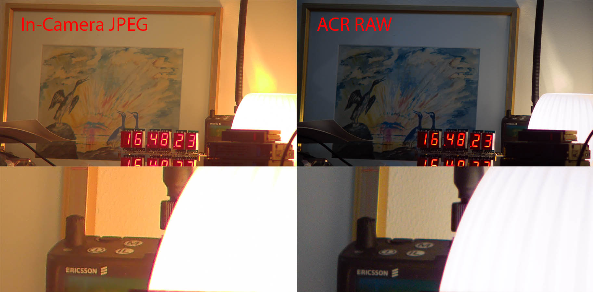

# HayerDebayer

This is a set of basic tools to work with Hayer HY-6110 .RAW still images.

The .RAW format of the HY-6110 can be accessed by changing the Image Format setting in the camera to JPEG+RAW.

The .RAW files are incredibly basic, they are 12-bit packed raw sensor dumps, without any debayering or seemingly any denoising or similar. The resolution is 3840x2160.

I made a set of tools to work with these images, the results are not perfect but are a dramatic improvement to achievable image quality. Below a comparison of the camera JPEG's and a basic ACR processed RAW file is shown.



`convert.py` uses OpenCV to read in the packed 12 bit format and try to convert it to a 16-bit TIFF format including debayering. This tool is interesting but will likely not be maintained as the .DNG method is much more practical for photographic purposes.

`hayerdng.py` uses PiDNG to read the packed 12 bit data and store it as a 16 bit linear DNG file that can be read in using e.g. Adobe Camera RAW or Lightroom.

`PiDNG` (use latest GitHub, not pip), `numpy`, and `OpenCV2` are required. The OpenCV part is only used for image rotation currently and could in principle be removed.

The tool embeds a set of (hard coded) colour correction matrices for two calibration temperatures made using a Macbeth chart at 6500 K and approximately 3000 K.

It takes no arguments and converts any .RAW file in it's current working directory into a .DNG file, overwriting any existing files.

The correction matrices were made using Adobe DNG Profile Editor, the exported .dcp files were then read out using dcpTool (MacOS binary included) and copied into the source code. The source files were *20230928_164557.RAW* (6500 K) and *20230928_164654.RAW* (3000 K).

Note that the PiDNG sample code at the time of writing will not produce a standards compliant .DNG. dng_validate was used to detect and correct these issues to make something ACR will accept. The validation tool is quite useful when making changes.

Currently the major issues are:

1. The JPEG previews in the .DNG files are not corrected (not major)
2. ACR doesn't correctly detect the white balance of the camera, thinking the image is much warmer than it actually is.E.g. a RAW file at 3000 K must be processed as approximately 5800 K with a heavy purple tint to make the white balance look right.

I *believe* this WB error is caused by incorrect ForwardMatrix1/2 entries. The current set is copied from the PiDNG source code for one of the Pi cameras and is not correct for this camera, but works better than leaving them out (without them the WB error was larger, and the saturation was very poor). From what I know there is enough data here to calculate appropriate matrices but I haven't gotten around to it yet.

To work around this I loaded up the two reference images in ACR and white balanced off the chart then saved those as presets for use as baselines for outdoors and indoor settings. It is also advisable to configure other parameters like CA removal at this time, but those are lens specific so you will have to make your own.

## Microphone Noise

The HY-6110 microphone input pinout is not documented:

* Tip: Unfiltered (noisy!) 3.3 V power supply through R88 on the I/O board
* Ring: 2 V biased electret microphone input
* Sleeve: Ground (differential to whatever processor/ASIC is used)

If your microphone is like mine it will be severely affected by the tip power supply, leading to significant noise in recordings. I removed R88 from the I/O board to disconnect this power supply and make it work with a fairly generic shotgun mic.

Using a microphone which only connects the signal output to the Ring would likely also work fine.

## Video Mode

Below is the output of mediainfo for a video recording in H.265 mode. In my opinion the video recordings look pretty good, much better than the JPEG outputs!

```
Format                                   : MPEG-4
Format profile                           : Base Media / Version 2
Codec ID                                 : mp42 (isom/avc1/mp42)
File size                                : 459 MiB
Duration                                 : 2 min 28 s
Overall bit rate mode                    : Variable
Overall bit rate                         : 25.9 Mb/s
Frame rate                               : 30.000 FPS
Encoded date                             : 2022-01-02 06:01:24 UTC
Tagged date                              : 2022-01-02 06:01:24 UTC

Video
ID                                       : 1
Format                                   : HEVC
Format/Info                              : High Efficiency Video Coding
Format profile                           : Main@L5@High
Codec ID                                 : hvc1
Codec ID/Info                            : High Efficiency Video Coding
Duration                                 : 2 min 28 s
Bit rate                                 : 25.6 Mb/s
Width                                    : 3 840 pixels
Height                                   : 2 160 pixels
Display aspect ratio                     : 16:9
Frame rate mode                          : Constant
Frame rate                               : 30.000 FPS
Color space                              : YUV
Chroma subsampling                       : 4:2:0
Bit depth                                : 8 bits
Bits/(Pixel*Frame)                       : 0.103
Stream size                              : 454 MiB (99%)
Language                                 : English
Encoded date                             : 2022-01-02 06:01:24 UTC
Tagged date                              : 2022-01-02 06:01:24 UTC
Color range                              : Full
Color primaries                          : BT.709
Transfer characteristics                 : BT.709
Matrix coefficients                      : BT.709
Codec configuration box                  : hvcC

Audio
ID                                       : 2
Format                                   : AAC LC
Format/Info                              : Advanced Audio Codec Low Complexity
Codec ID                                 : mp4a-40-2
Duration                                 : 2 min 28 s
Bit rate mode                            : Variable
Bit rate                                 : 96.0 kb/s
Channel(s)                               : 1 channel
Channel layout                           : M
Sampling rate                            : 32.0 kHz
Frame rate                               : 31.250 FPS (1024 SPF)
Compression mode                         : Lossy
Stream size                              : 1.70 MiB (0%)
Language                                 : English
```

## USB-C Mode

A USB-C to USB 3.0 A cable is included (many USB-C cables are too wide to fit the narrow camera cutout by the way).

When connected the camera works as a 4k30 capable webcam with monoaural audio, I haven't really tested it.

